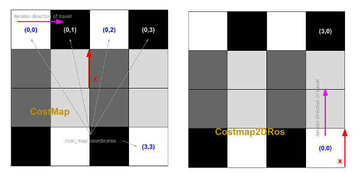
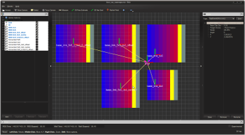
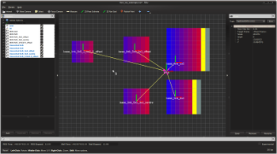
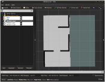
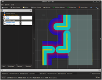
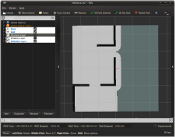

# Cost Map

This is a C++ library directly analogous to ETHZ ASL's [GridMap] library,
but designed for use with costs where the data element is an unsigned char (as opposed to grid_map's doubles).

## Table of Contents

1. [Packages Overview](#packages-overview)
2. [CostMap](#costmap)
3. [Publishing and Subscribing](#publishing-and-subscribing)
4. [Visualisations](#visualisations)
5. [Saving and Loading](#saving-and-loading)
6. [Costmap2DROS Conversions](#costmap2dros-conversions)
7. [Other Conversions](#other-conversions)
8. [Inflation Computers](#inflation-computers)

## Packages Overview

* ***cost_map*** : meta-package for the grid map library.
* ***cost_map_core*** : core interfaces and algorithms of the cost map library, this package has no [ROS] dependencies.
* ***cost_map_ros*** : converters and utilities for cost maps in a [ROS] ecosystem - Image Bundles, CostMap2DROS, OccupancyGrid, CostMap messsages.
* ***cost_map_cv*** : conversions from and to [OpenCV] image types.
* ***cost_map_msgs*** : [ROS] message definitions related to the [cost_map_msgs/CostMap] type.
* ***cost_map_visualisations*** : helper nodes that bridge cost maps to [RViz].
* ***cost_map_demos*** : several nodes for demonstration purposes and a test suite.

The source code is released under a [BSD 3-Clause license](LICENSE).

## CostMap

The core `cost_map::CostMap` class is designed to maintain as close a compatibility
to grid maps as possible. This compatibility extends to conventions, definitions and API.
For convenience, an illustrative reference of a few of the conventions that hold for both
cost maps and grid maps is provided below.

[](cost_map_core/doc/grid_map_layers.pdf)

[](cost_map_core/doc/grid_map_conventions.pdf)

Please refer to the [GridMap README](https://github.com/ethz-asl/grid_map/blob/master/README.md) for a
more comprehensive outline of what is possible with cost maps and grid maps.

Doxygen documentation for the cost map API's is served via the *Code API* links on the
[ROS wiki](http://wiki.ros.org/cost_map) for each respective release/package. In addition
the latest doxygen documentation can always be found for each package at:

* [cost_map_core](http://docs.ros.org/api/cost_map_core/html/annotated.html)
* [cost_map_ros](http://docs.ros.org/api/cost_map_ros/html/annotated.html)
* [cost_map_visualisations](http://docs.ros.org/api/cost_map_visualisations/html/annotated.html)

## Publishing and Subscribing

Use the `cost_map::toMessage()/fromMessage(...)` methods.

```cpp
// Publishing

#include <cost_map_ros/converter.hpp>

void publishCostMap(const cost_map::CostMap& cost_map) {
  cost_map_msgs::CostMap msg;
  toMessage(cost_map, msg);
  publisher.publish(msg);
}
```

```cpp
// Subscribing

#include <cost_map_ros/converter.hpp>

void costMapCallback(const cost_map_msgs::CostMap::ConstPtr& msg) {
  cost_map::CostMap cost_map;
  cost_map::fromMessage(*msg, cost_map);
}
```

## Visualisations

As with grid maps, the method employed to visualise is to drop in a relay node between
the cost map publisher and rviz to convert it to the appropriate type for visualisation.
This spares you from having to write any gui-related code in the cost maps or the
planners/controllers that use the cost maps.

`cost_map_visualisations` has a relay node that converts each layer of a subscribed
cost map topic to a `nav_msgs/OccupancyGrid` topic for rviz. Simply include and
remap the input cost map topic in your launcher, for example:

```xml
<launch>
  <!-- node that publishes cost maps -->

  <node pkg="cost_map_visualisations" type="node" name="cost_map_visualisation">
    <remap from="cost_map_visualisation/cost_map" to="funky_cost_maps/cost_map"/>
  </node>

  <!-- rviz, with a pre-loaded configuration that loads the resulting occupancy grid maps -->
  <node name="rviz" pkg="rviz" type="rviz" args="-d $(find funky_demos)/rviz/funky_cost_maps.rviz" />
</launch>
```

An example of a relay in action is in the image bundle demo below.

## Saving and Loading

### Image Bundles

Image bundles provide an easy way to load and save cost maps to and from files on disk.
An image bundle consists of data stored in two parts - 1) meta-information about a costmap in
a yaml file and 2) layer data that is stored alongside in grayscale images.

A typical meta yaml for an image bundle:

```yaml
# frame in the world that this map is attached to
frame_id: map
# co-ordinates of the centre of the map relative to the frame_id
centre_x: 0
centre_y: 0
# dimensional properties of the map
resolution: 0.05
number_of_cells_x: 200
number_of_cells_y: 200
# data layers
layers:
  - layer_name: obstacle_costs
    layer_data: obstacle_costs.png
  - layer_name: static_costs
    layer_data: can_be_some_other_name.png
```

See [cost_map_ros/image_bundles/example.yaml](cost_map_ros/image_bundles/example.yaml) for a real example.

### ImageBundle Demo

```bash
# load an image bundle and visualise the cost map
roslaunch cost_map_demos load_image_bundle.launch --screen
```

### ImageBundle Command Line Utilities

There exist two command line utilities for loading and saving to and from a cost map topic:

```bash
# load and publish to '/foo/cost_map'
rosrun cost_map_ros load_image_bundle -t /foo/cost_map example.yaml
# subscribe and save from '/foo/cost_map' to foo.yaml
mkdir foo
cd foo
rosrun cost_map_ros save_image_bundle /foo/cost_map foo.yaml
```

### ImageBundle Methods

* `cost_map::toImageBundle(...)` : save a cost map to an image bundle
* `cost_map::fromImageBundle(...)` : load an image bundle into a cost map object

See the [LoadImageBundle](cost_map_ros/src/lib/image_bundles.cpp#L203)/[SaveImageBundle](cost_map_ros/src/lib/image_bundles.cpp#L235)
classes which illustrate how the command line utilities use these api.

## Costmap2DROS Conversions

The ROS Navistack uses `costmap_2d::Costmap2DROS` objects and it is sometimes necessary
to make conversions from these to provide new style cost maps to other libraries. Methods are
available for both full map conversion as well as subwindows centred on the pose of the robot itself.

### Costmap2DROS vs CostMap

[](cost_map_ros/doc/image_loading_coordinates.png)

### Costmap2DROS Demo

Costmap2DROS | Full/Partial Copies
:---: | :---: | :---:
[](cost_map_demos/doc/images/from_ros_costmaps/from_ros_costmaps.png) | [](cost_map_demos/doc/images/from_ros_costmaps/from_ros_costmaps_copied.png)


```bash
# load several ros costmaps and copy full/sub windows to new style costmaps
roslaunch cost_map_demos from_ros_costmaps.launch --screen
```

### Costmap2DROS Methods

* `cost_map::fromCostmap2DROS(...)` : create a cost map from a Costmap2DROS
* `cost_map::fromCostmap2DROSAtRobotPose(...)` : create a cost map from a subwindow around the robot pose in a Costmap2DROS

See the [from_ros_costmaps demo program](cost_map_demos/src/applications/from_ros_costmaps.cpp)
which illustrates how to use these api. Additionally you can directly use the `grid_map::Costmap2DConverter` template class for more atomic operations.

## Other Conversions

* `cost_map::toGridMap(...)` : convert to a float based grid map by normalising values between 0.0 and 100.0
* `cost_map::addLayerFromROSImage(...)` : add a layer from ros immage message type (sensor_msgs::Image)

## Inflation Computers

### Inflation Demo

```bash
# load an image bundle and visualise the cost map
roslaunch cost_map_demos inflations.launch --screen
```

Obstacle Layer | Inflated Layer | Deflated Layer
:---: | :---: | :---:
[](cost_map_demos/doc/images/inflation/obstacle_layer.png) | [](cost_map_demos/doc/images/inflation/inflation_layer.png) | [](cost_map_demos/doc/images/inflation/deflated_layer.png)

### Inflation Classes

* `cost_map::Inflate` : functor that executes (with the assistance of an inflation computer) the inflation process
* `cost_map::ROSInflationComputer` : emulates the ROS inflation algorithm
* `cost_map::Deflate` : functor reverses an inflation computation

See the [inflation demo program](cost_map_demos/src/applications/inflations.cpp)
which illustrates how to use these classes.

[GridMap]: https://github.com/ethz-asl/grid_map
[OpenCV]: http://opencv.org/
[ROS]: http://www.ros.org
[RViz]: http://wiki.ros.org/rviz
[cost_map_msgs/CostMap]: http://docs.ros.org/api/cost_map_msgs/html/msg/CostMap.html

